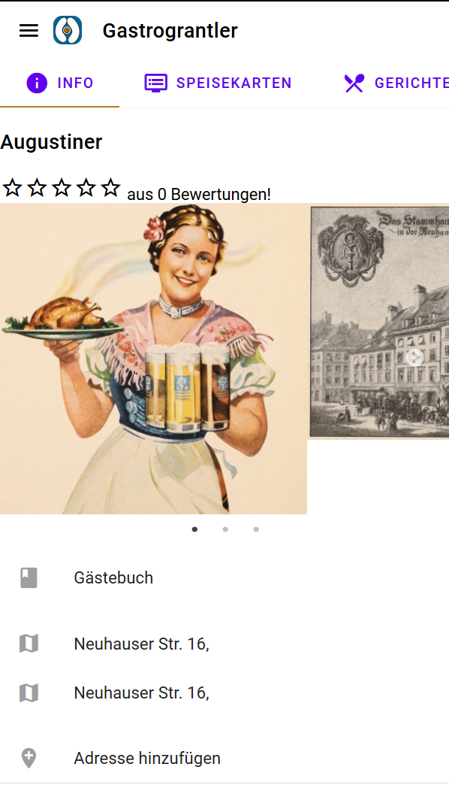
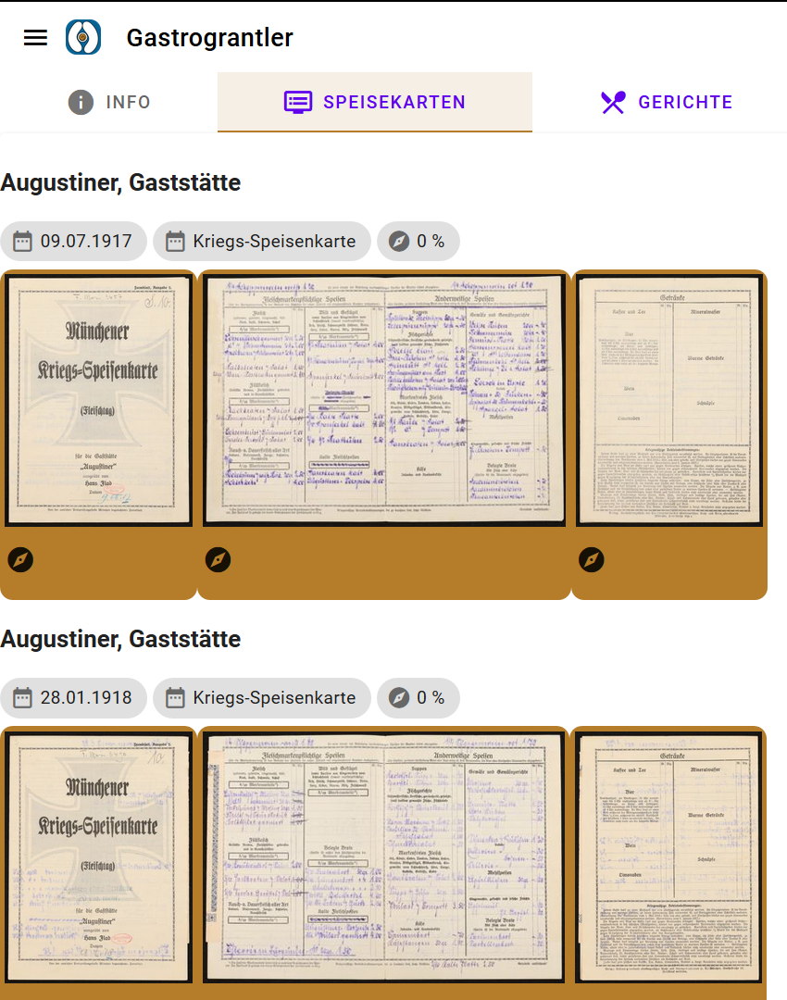
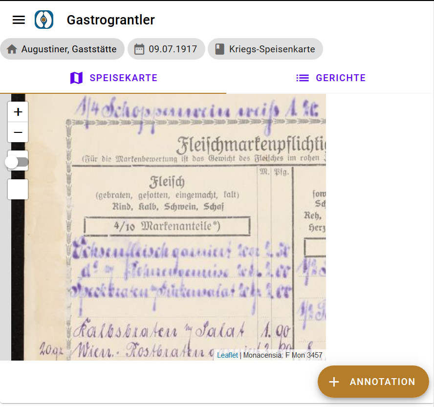
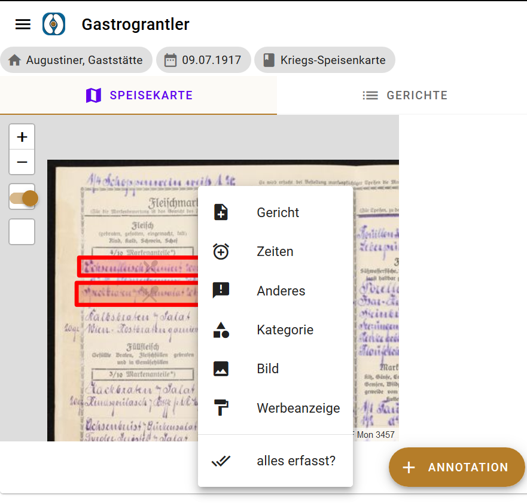
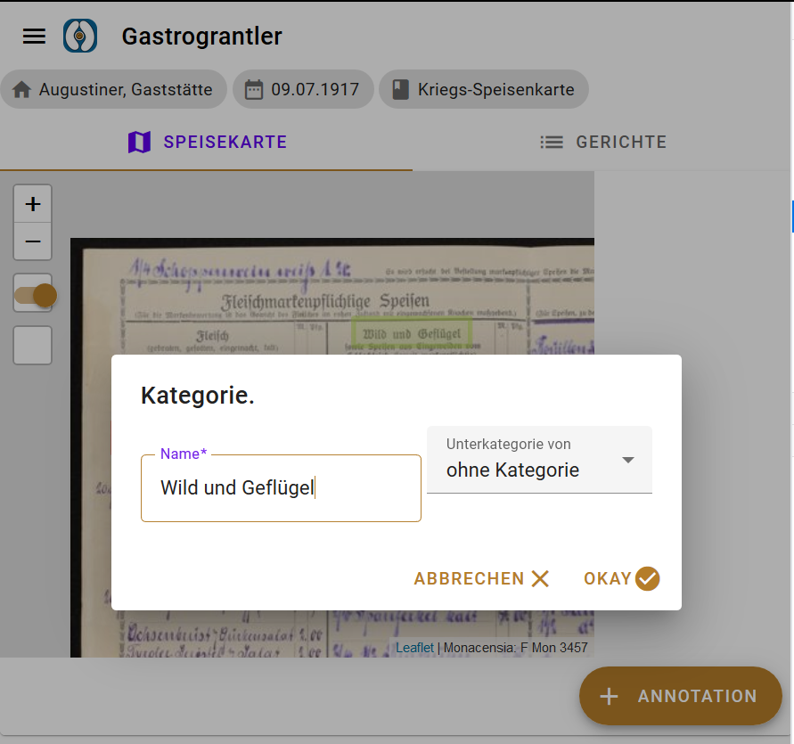
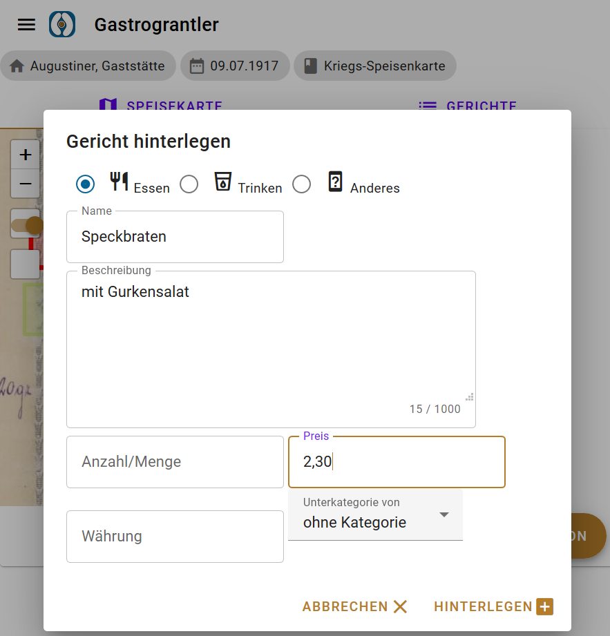
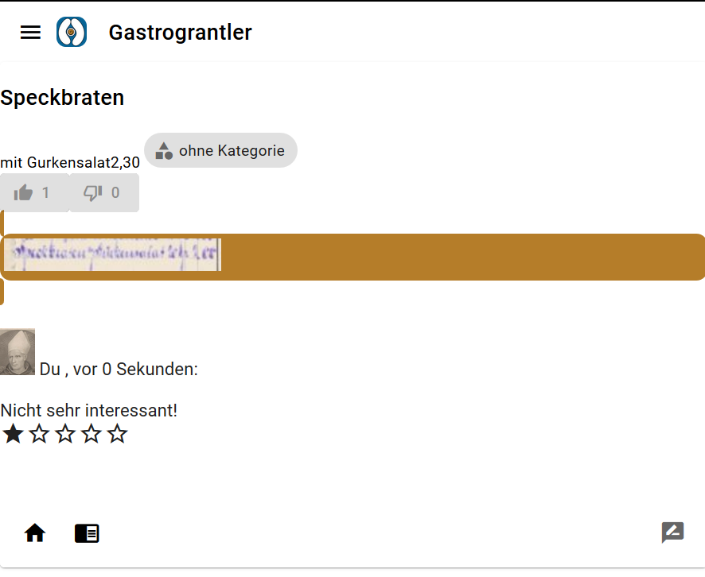

**Gastrograntler**

Speisekarten App  
Cod1ng da V1nc1 Süd 2019  

Installationsanleitung:  
Gastrograntler läuft zurzeit nur offline, da uns die Kapazitäten für einen Serverbetrieb (> 10 GB Speicherplatz für die Bilder) fehlen.  

Für ein zufriedenstellendes Benutzerlebnis ist ein lokaler IIIF-Server zur Anzeige der Bilder notwendig.  

IIIF-Server:  
- Cantaloupe 4.0.3 (https://cantaloupe-project.github.io/) installieren und Installationsanleitung befolgen  
- Ordner aus der Monacensia mit den Dateien (https://download.codingdavinci.de/index.php/s/GTZZHDKqqpzKnsR?path=%2F) downloaden, die Verzeichnisstruktur beibehalten und in den bei der Cantaloupe-Config festgelegten Bilderpfad legen  
- Optional: unter js/data/data_config.js config.iiifserver den Aufrufpfad (Url/port/Ordner/) zum IIIF-Server ändern. Defaultmäßig ist dieser http://localhost:8182/iiif/v2/  

(Optional: CouchDB)  
Ein Sync der lokal gespeicherte Browserdaten mit einer zentralen Datenbank kann mit einer lokalen oder einer serverseitgen CouchDB geschehen.  
- Apache CouchDB 2.3.1 (http://couchdb.apache.org/) installieren  
- Datenbanken in der CouchDB zum Sync anlegen. Die Liste der Datenbank kürzel befinden sich unter js/DB/DB.js  
- Optional: unter js/data/data_config.js config.couchDB den Aufrufpfad (Url/port/Ordner/) zur CouchDB-Server ändern. Defaultmäßig ist dieser http://localhost:5984/  

**Ausführen: **     
index.html aufrufen.

Einige Browser (Chrome) brauchen den Aufruf von einen Webserver für Funktionalitäten des ServiceWorkers (Add to Homescreen, Push Notifications):  
- python -m http.server,
- dann localhost:8000

Screens:
Suchfunktion in der Liste der Wirtshäuser:

Detailansicht des Wirtshaus Augustiner:

Detailansicht der Speisekarten des Wirtshaus Augustiner:

Detailansicht einer eingezoomten Speisekartenseite:

Auswählen einer Kategorie nach dem Zeichnen einer Fläche

Info-Dialog zu Kategorie ausfüllen

Info-Dialog zu Gericht ausfüllen

Anzeige der Info aus einer Annotation

Stadtplan mit ausgewähltem Wirtshaus

Deine Bewertungen und Annotationen

Alle Gerichte eines Gasthauses anzeigen

Bewertung zu einem Gericht hinterlassen

Bewertungen zu einem Gericht anzeigen

Offenes Menü:

